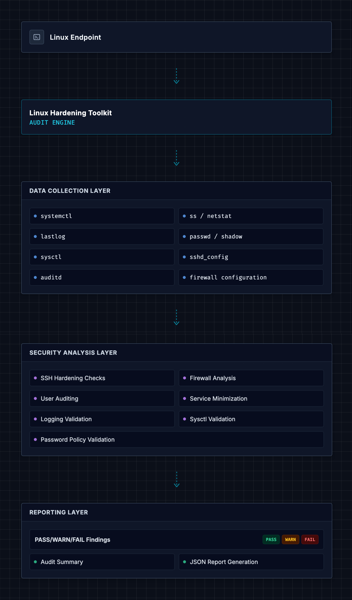
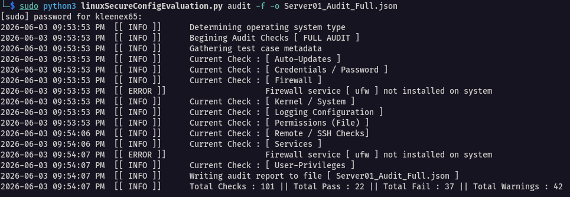
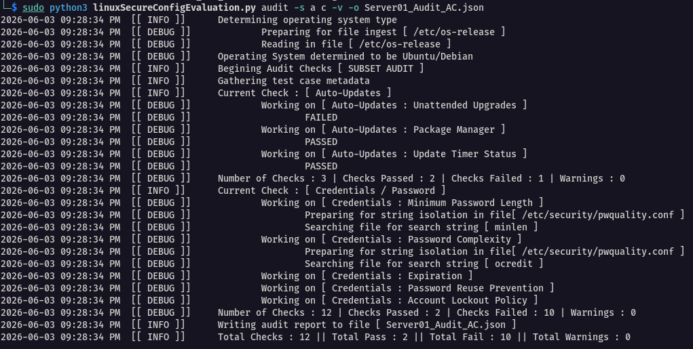
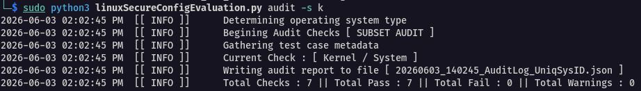
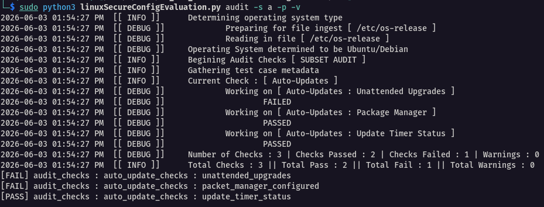

# Linux Hardening Toolkit

Python-based Linux security auditing toolkit designed to identify insecure system configurations and validate common hardening controls.

The toolkit performs automated checks aligned with common enterprise security practices and CIS benchmark concepts.



---

## Features

### SSH Hardening Checks
- Detects root SSH login configuration
- Validates password authentication settings
- Checks SSH idle timeout configuration
- Identifies insecure SSH settings

### Firewall Validation
- Detects UFW/firewalld status
- Validates firewall enablement
- Checks secure deny-by-default settings
- Checks exposed listening ports

### Logging & Auditing
- Verifies `auditd` status
- Detects rsyslog configuration
- Checks journald persistence
- Validates log rotation configuration

### User & Privilege Auditing
- Identifies UID 0 accounts
- Detects users with sudo privileges
- Checks for service accounts with interactive shells

### Sysctl Hardening
- Verifies secure kernel parameters
- Checks IP forwarding configuration
- Validates SYN cookie protection

### Automatic Update
- Checks unattended upgrades enablement
- Detects configured package manager
- Verifies active update timer

### Credential Policy Auditing
- Verifies secure password configuration

### Sensitive File Permissions
- Checks for world-writable files
- Detects improper SSH key permissions
- Identifies SUID / SGID binaries
- Verifies sensitive file ownership

### Service Minimization
- Identifies running services (notes typical risk level)
- Checks exposed network services
- Detects legacy protocols (e.g. telnet, rsh, cups, etc.)

### Reporting
- Terminal-based results
- JSON audit report generation

---
## Script Modes of Operation 

### Info
Info-Mode is used simply to output the scripts general purpose as well as available checks / information about those checks.

### Audit
Audit-Mode has two built-in run options: Full Audit or Subset Audit

#### Full Audit (--full, -f)
The full audit option for operation completes all audit checks currently available

#### Subset Audit (--subset, -s)
The subset audit option for operation allows the user to select the checks to be done.
The user can select a single audit check to run, or the user can select multiple audit checks to run.

---

## Example Output

Console output:

```text
[FAIL] audit_checks : auto_update_checks : unattended_upgrades
[FAIL] audit_checks : auto_update_checks : packet_manager_configured
[PASS] audit_checks : auto_update_checks : update_timer_status
[PASS] audit_checks : credential_policy_checks : minimum_password_length
[FAIL] audit_checks : credential_policy_checks : password_complexity : required_character_classes
[FAIL] audit_checks : credential_policy_checks : password_complexity : required_character_digit
[FAIL] audit_checks : credential_policy_checks : password_complexity : required_character_lowercase
[FAIL] audit_checks : credential_policy_checks : password_complexity : required_character_uppercase
[FAIL] audit_checks : credential_policy_checks : password_complexity : required_character_special
[FAIL] audit_checks : credential_policy_checks : password_expiration
[FAIL] audit_checks : credential_policy_checks : password_reuse_prevention
[PASS] audit_checks : credential_policy_checks : account_lockout_policy
[FAIL] audit_checks : firewall_checks : firewall_enabled
```

Generated JSON report:

```json
{
    "scan_metadata": {
        "hostname": "tester01",
        "os": "Linux-6.19.14+kali-amd64-x86_64-with-glibc2.42",
        "kernel_version": "#1 SMP PREEMPT_DYNAMIC Kali 6.19.14-1+kali1 (2026-05-05)",
        "scan_timestamp": "20260603_100709"
    },
    "audit_checks": {
        "auto_update_checks": {
            "unattended_upgrades": {
                "expected": "enabled",
                "actual": "disabled",
                "status": "FAIL"
            },
            "packet_manager_configured": {
                "expected": "apt",
                "actual": "apt",
                "status": "FAIL"
            },
            "update_timer_status": {
                "expected": "active",
                "actual": "active",
                "status": "PASSED"
            }
        },
    ...
    ...
    },
    "audit_summary": {
        "Total_Checks": 61,
        "Total_Pass": 22,
        "Total_Fail": 34,
        "Total_Warn": 2
    }
}
```
---

## Example Usage

### Full Audit (--full, -f)



### Subset Audit (--subset, -s)



### Sysctl Hardening



### Automatic Update


---

## Project Structure

```text
linux-hardening-toolkit/
├── src/
│   ├── linuxSecureConfigEvaluation.py
│   └── services.py
├── docs/
├── screenshots/
├── examples/
├── reports/
├── tests/
├── requirements.txt
└── README.md
```

---

## Installation

Clone the repository:

```bash
git clone https://github.com/leewaye-sec/linux-hardening-toolkit.git
cd linux-hardening-toolkit
```

---

## Usage

Run the audit tool: --help

```bash
python3 src/linuxSecureConfigEvaluation.py --help
```

Run the audit tool: audit --full with verbose logging

```bash
python3 src/linuxSecureConfigEvaluation.py audit --full -v
```

Generate JSON report with specific name:

```bash
python3 src/linuxSecureConfigEvaluation.py audit --full --output server01_secure_configuration_audit_2026.json
```

Output results to STDOUT only:

```bash
python3 src/linuxSecureConfigEvaluation.py audit --full --print
```

---

## Security Considerations

- The toolkit is intended primarily for auditing and validation.
- No system changes are performed by default.
- Elevated privileges are required for certain checks.
- The tool does not store credentials or transmit data externally.

---

## Technologies Used

- Python 3
- Linux
- systemctl
- UFW / firewalld
- JSON reporting

---

## Learning Objectives

This project was built to improve practical skills in:
- Linux security hardening
- Security automation
- Python scripting
- System auditing
- Infrastructure security
- Security reporting

---

## Planned Features

- Auto-remediation mode

---

## Disclaimer

This project is intended for educational and authorized security auditing purposes only.

---

## License

MIT License
