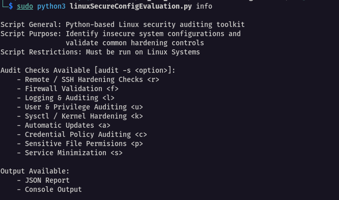
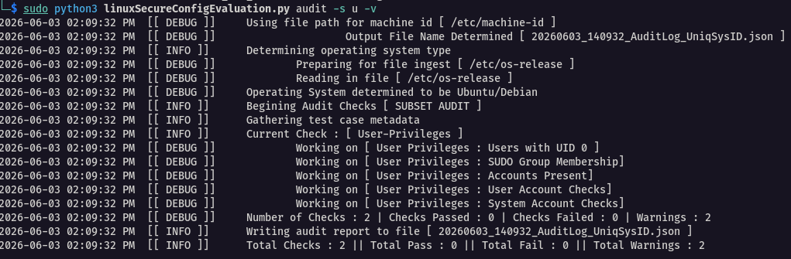
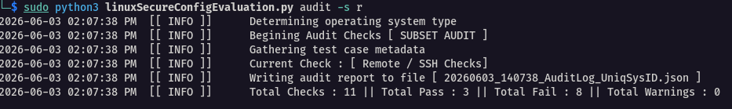
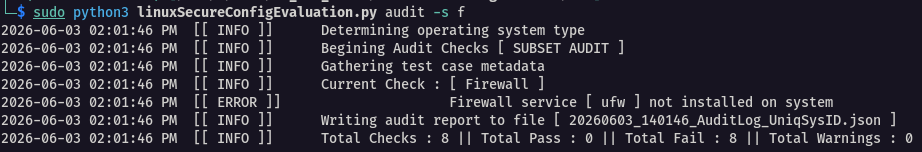
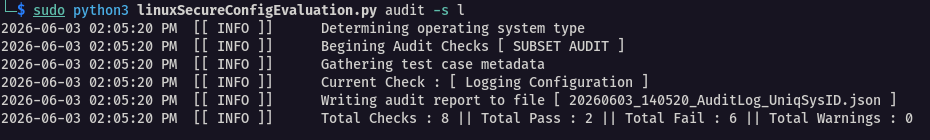
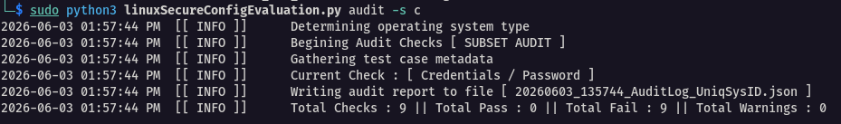
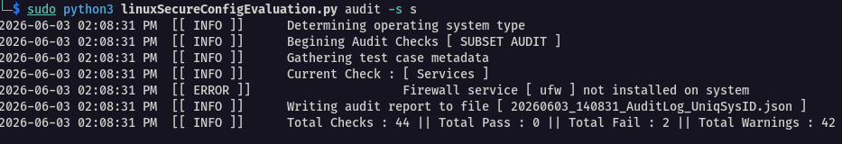

# Examples

---

## Script Modes of Operation 

### Info

### Audit

#### Full Audit (--full, -f)

#### Subset Audit (--subset, -s)

---
## Audit Check Examples

### SSH Hardening Checks

### Firewall Validation

### Logging & Auditing

### User & Privilege Auditing

### Sysctl Hardening

### Automatic Update

### Credential Policy Auditing

### Sensitive File Permissions

### Service Minimization

